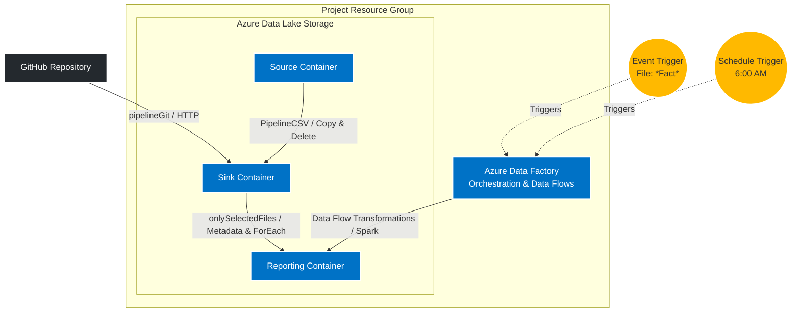

# ☁️ Azure Data Orchestration: Dynamic Pipelines & Data Flows

> An advanced data engineering project focused on building dynamic, event-driven pipelines. This architecture pulls data from external web sources (GitHub), dynamically filters and processes files based on metadata, and transforms the data using Spark-backed Mapping Data Flows in Azure Data Factory.

---

## 🏗️ Architecture Overview

The infrastructure relies heavily on Azure Data Factory as the central orchestrator, managing complex logic across multiple interconnected pipelines and communicating with distinct containers inside an Azure Data Lake.

## 🚀 What I Deployed

| Resource Type | What I Used It For |
| :--- | :--- |
| **Azure Data Factory (ADF)** | The core compute and orchestration engine. It houses 4 separate interconnected pipelines, dataset connections, Mapping Data Flows, and Triggers. |
| **Azure Storage Account (Data Lake)** | My primary storage layer. I utilized different logical containers (Source, Sink, and Reporting) to separate raw data from transformed data. |
| **Mapping Data Flows** | Built natively inside ADF, this uses a managed Apache Spark cluster in the backend to perform heavy data transformations on the reporting data. |

## ⚙️ Pipeline Architecture & Workflow

To keep the logic modular and maintainable, I split the workflow into four distinct pipelines and automated them using two specific triggers.

### ⏱️ Automation (Triggers)

* **Storage Event Trigger:** Configured to automatically fire the master pipeline whenever a new file containing the word `"Fact"` in its name is dropped into the storage account.
* **Schedule Trigger:** Set up to automatically run a batch process every day at exactly **6:00 AM**.

### 🛠️ The 4 Pipelines

**1. `PipelineGit` (External Ingestion)**
Uses an **HTTP Dataset** via a Copy Activity to fetch raw data directly from a GitHub URL and land it directly into the Data Lake *Sink* container.

**2. `PipelineCSV` (Internal Movement & Cleanup)**
Uses a Copy Activity to migrate files from the Data Lake *Source* container to the *Sink* container. It connects to a **Delete Activity** upon success to instantly clean up the file from the source container. It also uses an **Execute Pipeline Activity** to trigger `pipelineGit` as part of its flow.

**3. `onlySelectedFiles` (Dynamic Filtering & Transformation)**
Validates that the sink file is present, reads the properties of files currently in the sink container using **GetMetadata**, and iterates over them using a **ForEach** loop. An **If Condition** checks each file name, and if it `startsWith('Fact')`, it triggers a dynamic Copy Activity to move only those specific files into the *Reporting* container. Once there, a **Data Flow Activity** (running on Spark clusters) transforms the data for final business use.

**4. `ProdPipeline` (The Master Orchestrator)**
This is the parent pipeline tied to the Storage Event trigger. It uses **Execute Pipeline Activities** to invoke both `onlySelectedFiles` and `PipelineCSV`, seamlessly controlling the entire master workflow.

## 🚧 Roadblocks & How I Fixed Them

* **Handling File Deletions Safely:** The Delete Activity in `PipelineCSV` could cause permanent data loss if the preceding copy failed. I fixed this by carefully configuring the dependency conditions (the green checkmark path) so the Delete Activity only executes on a "Success" output from the Copy Activity.
* **GetMetadata File Limits:** Passing a massive list of files from `GetMetadata` into a `ForEach` loop can cause concurrency bottlenecks. I resolved this by configuring the `ForEach` loop settings to manage batch counts efficiently.
* **Data Flow Cluster Startup Time:** When the Mapping Data Flow triggered, the backend Spark cluster took several minutes to spin up. I fixed this by enabling Data Flow integration runtime **Time to Live (TTL)** settings, keeping the compute cluster warm for consecutive runs to drastically reduce execution time.

## 💡 What I Learned

* **Dynamic Data Integration:** I learned how to move past hardcoded file names by utilizing `GetMetadata`, `ForEach`, and `If Condition` activities to build highly dynamic, rules-based data movement.
* **Spark Abstraction:** Getting hands-on with Mapping Data Flows showed me how ADF abstracts the complexity of Apache Spark, allowing me to build robust data transformations using a visual interface.
* **Event-Driven Architecture:** Moving away from manual runs to a fully event-driven model using Storage Event triggers makes the infrastructure feel truly automated and responsive.
